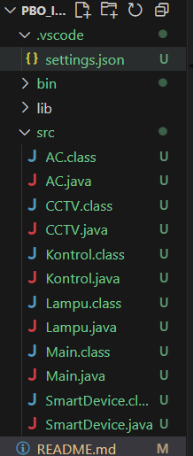

# PBO_Inheritance-Polymorphism-Abstract-Class-atau-Interface-dan-Array-of-Object

## Identitas
- Nama: M. Wahyu Hilal Abroor
- NIM: F1D02310123
- Tugas: Inheritance, Polymorphism, Abstract Class/Interface, dan Array of Object

## Deskripsi Program
Program ini adalah program yang mensimulasikan sistem rumah pintar dengan beberapa perangkat seperti Lampu, AC, dan CCTV. Setiap perangkat merupakan turunan dari kelas abstrak `SmartDevice` dan dapat memiliki fitur otomatis melalui interface `Kontrol`. Program mendemonstrasikan konsep inheritance, polymorphism, abstract class, interface, dan penggunaan array of object.

## Struktur Kelas



- **SmartDevice (abstract class):** Kelas dasar untuk semua perangkat, berisi atribut nama dan status, serta method dasar.
- **Kontrol (interface):** Interface untuk fitur otomatis perangkat.
- **Lampu, AC, CCTV (class):** Turunan dari SmartDevice dan mengimplementasikan Kontrol, masing-masing dengan fitur khusus.
- **Main (class):** Berisi method `main` untuk menjalankan simulasi dan mendemonstrasikan fitur perangkat.

```
SmartDevice (abstract)
│
├── Lampu (implements Kontrol)
├── AC (implements Kontrol)
└── CCTV (implements Kontrol)
Kontrol (interface)
Main
```

## Penjelasan Kode
- **SmartDevice:** Menyimpan nama perangkat dan status (ON/OFF). Method `hidupkan` dan `matikan` untuk mengubah status, serta method abstrak `tampilkanStatus`.
- **Kontrol:** Interface dengan method `aktifkanOtomatis` dan `nonaktifkanOtomatis` untuk fitur otomatis perangkat.
- **Lampu:** Memiliki atribut tingkat kecerahan dan method untuk mengatur kecerahan.
- **AC:** Memiliki atribut suhu dan method untuk mengatur suhu.
- **CCTV:** Memiliki mode rekam dan method untuk memulai perekaman.
- **Main:** Membuat array berisi objek perangkat, menyalakan perangkat, menampilkan status, mengaktifkan fitur otomatis, dan menjalankan fitur khusus masing-masing perangkat.

## Kesimpulan
Program ini berhasil mengimplementasikan konsep inheritance, polymorphism, abstract class, interface, dan array of object dalam simulasi sistem rumah pintar. Setiap perangkat dapat memiliki fitur dan perilaku khusus, serta dapat diakses secara polymorphic melalui array bertipe induk. Struktur kode modular dan mudah dikembangkan untuk menambah perangkat baru.